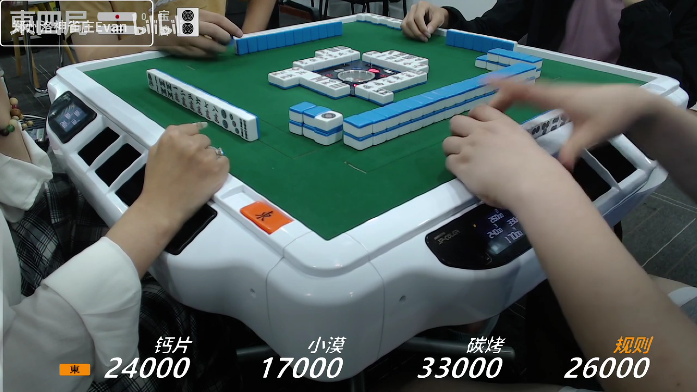
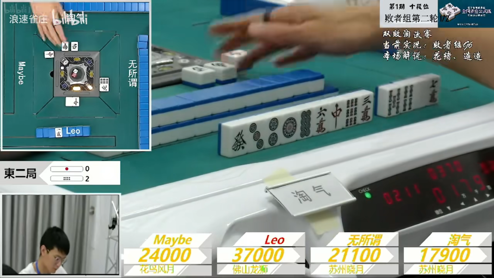
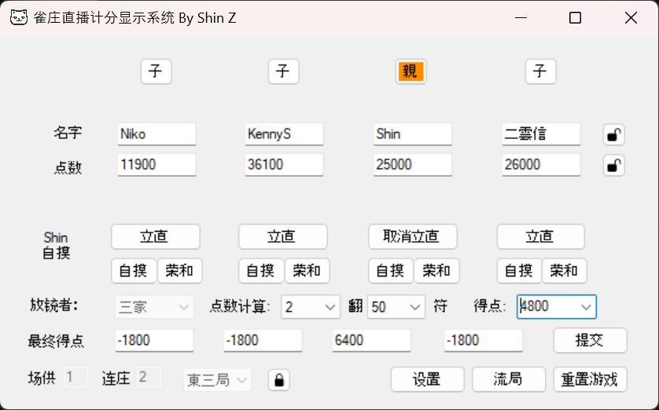

# Riichi Display – Mahjong Game Livestream Score System 🀄

## Overview
The **Riichi Display** is a Windows Forms application designed to manage and display player information, scores, and other relevant details during a Riichi Mahjong livestream. It allows users to interactively update player details, manage scoring, and ensure that the livestream audience stays informed about the ongoing game details by a simple click.  

The language of this program is Simplified Chinese.  
本程序的语言为简体中文。  
このプログラムの言語は簡体字中国語です。  

[**See release for download**](https://github.com/nikmomo/Riichi-Display/releases)  

Examples:  
<!--  -->
[*Zhengzhou luoshen mahjong club*](https://www.bilibili.com/video/BV12V4y1i7h6)  

  
<!--  -->
[*Langsu mahjong club*](https://www.bilibili.com/video/BV1Q34y1T7yt)  


*Control Panel*  
<!--  -->


## 🚀 Getting Started
To get started with the project, clone the repository and ensure you have Visual Studio 2019 or later installed.  

```
bash
git clone https://github.com/nikmomo/Riichi-Display
```

## 🛠 Setup & Installation
Navigate to the cloned directory.  
Open the solution file (.sln) using Visual Studio.  
Restore the NuGet packages if necessary and build the solution to ensure everything is set up properly.  
Start the application using Ctrl + F5 or F5 if you wish to run with debugging.  

## ⚙ Features
Player Management: Keep track of player details including names, teams, points, and more.  
Scoring Management: Effortlessly manage and display scoring details during a livestream.  
Dynamic Updates: Ensure your livestream audience is always in the loop with real-time updates to player details and scores.  
Automation: All updates are automated, this program only requires user to input winner condition.  
Font Customization: Personalize the display with a variety of font options to match your streaming aesthetics.  

## 📝 Configuration
The application allows you to manage various settings to tailor the user experience according to your needs:  
  
Name Management: Assign player's name and lock the edit when you don't want to accidently change it.  
Team Management: Enable/Disable team displays and customize the team name.  
Point Management: Manually change the point or changing the point using the point toggle zone.  
Wind Indicator control: Toggle visibility of the wind direction indicator, switch the wind indicator between east and south.  
Dora management: Set dora to the status bar.  
Font Settings: Customize font settings for various display elements.  

## 🔄 Usage
Player Setup: Enter player names, and teams (optional).  
Round Management: Update points and add/subtract scores as the game progresses by using the point toggle zone.  
Font and Appearance: Customize appearance settings for the display.  
Output: Ensure the display is broadcasted as an overlay or separate window in your livestream. Filtering out green background for a better vision.  
Reset Game: Reset the game by clicking "重置游戏".  

## 📦 Building and Publishing
Follow the standard process in Visual Studio to build and publish the application. Ensure you have set the correct build configuration and publish settings for deploying the application.  

## 🛑 Known Issues
- Winform has bad performance on animation.  
- Adding shortcut feature might requires administrator permission.
- Does not use multi-threading to run the program, there might caused some delays when launching.  

## 📚 Contributing
If you'd like to contribute, please fork the repository and use a feature branch. Pull requests are warmly welcome.  

## 🔒 License
This project is licensed under the GNU General Public License v3.0 - see the [LICENSE](LICENSE.md) file for details.  

## 📞 Contact
For more information, questions, or feedback, please reach out to Shin Z (zhenz@vt.edu) or post a issue in this repository.  
